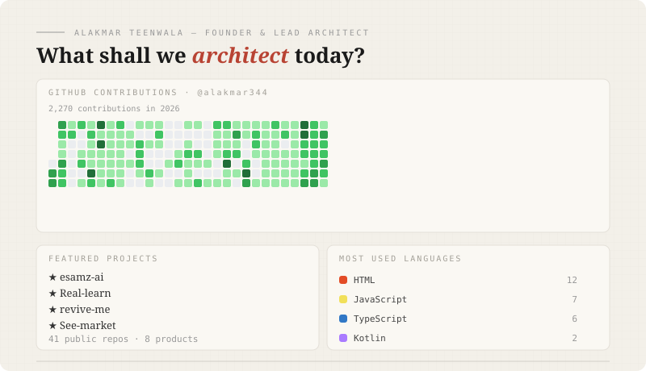

<div align="center">



# Al-Aqmar Tinwala — القمر · "The Moon"

**13-year-old privacy-first AI builder · founder of [eSAMz](https://esamz.me) · I ship, then I explain the math.**

Heart First · Privacy First · Curious · Technical · Builder

</div>

---

I build AI products people actually use — **11 live products, 3,000+ users** — and I build the *layers under them* too: transformer training frameworks, voxel engines, privacy-preserving analytics, and Android launchers.

> 🏠 **Workshop & live products:** [esamz.me](https://esamz.me)

---

## 🔬 What I'm most proud of

| Project | What it proves |
|---------|----------------|
| [**youAI**](https://github.com/alakmar344/youAI-2B-From-Scratch-Transformer-Implementation) | A 7,500-line from-scratch Transformer training framework — RoPE, RMSNorm, GQA, KV-cache, LoRA/QLoRA, DPO/ORPO/SimPO alignment, DARE/TIES/SLERP model merging, multi-GPU training, FastAPI streaming server, 14 test files |
| [**Gati**](https://github.com/alakmar344/gati) | A 14,000-line India-first "mobility OS" — intent-based command palette, bilingual voice commands (Web Speech API), OCR document scanning, 180+ i18n entries |
| [**Vinecraft**](https://github.com/alakmar344/vinecraft) | A voxel game engine in vanilla JavaScript — chunked procedural terrain, 10 biomes, 46 block types, weather, shadow mapping, mobile touch controls |
| [**ATOMVERSE (π)**](https://github.com/alakmar344/science-project) | The code behind my live π science playground — a custom no-WebGL 3D orthographic renderer built for low-spec school laptops, verified NCERT chemistry |
| [**analytics-hub**](https://github.com/alakmar344/analytics-hub) | Privacy-first self-hosted analytics — raw IPs are never stored (HMAC-SHA256 hashing, unit-tested). The anti-Google-Analytics |
| [**eSAMz flagship**](https://github.com/alakmar344/esamz.a) | My production AI assistant — consent acceptance/revoke as first-class backend routes, PWA, Clerk auth, 112 commits of iteration |

## 🚀 More shipped things

- **[See-market](https://github.com/alakmar344/See-market)** — live market-intelligence platform (RSI/MACD computed server-side) · [see-market.vercel.app](https://see-market.vercel.app)
- **[eSAMz Code (My-code)](https://github.com/alakmar344/My-code)** — an agentic coding IDE that runs on phones (Docker sandbox, NDJSON streaming)
- **[Not-a-thing-launcher](https://github.com/alakmar344/Not-a-thing-launcher)** — Android launcher with 3 tagged APK releases
- **[revive-me](https://github.com/alakmar344/revive-me)** — Rust local-only legacy-data bridge (.dbf/.xls → clean JSON)
- **[Cibo Cocinar](https://github.com/alakmar344/CIBO-COCINAR)** · **[Hissab](https://github.com/alakmar344/Hissab-)** · **[PivotIQ](https://github.com/alakmar344/PivotIQ)** — voice-first cooking, small-biz fintech, startup validation (all live)

## 🧭 The thread connecting it all

```
prompt-engineered chatbot (sam.ai, Oct 2025)
   → production AI assistant with consent architecture (esamz.a)
      → training transformers from scratch (youAI)
         → an AI that writes code (eSAMz Code)
```

I use AI → I ship an AI product → I understand AI at the math level → I build AI tooling.

## 🛠 Toolbox

`Next.js` `React` `TypeScript` `JavaScript` `Python` `PyTorch` `Rust` `Kotlin` `Java` `C++` `Tailwind` `Vite` `Express` `FastAPI` `MongoDB` `Docker` `Clerk` `PWA` `Web Speech API` `Three.js` `FFmpegKit` `Vercel` `Git/GitHub`

## 📚 Elsewhere

- 🏠 Portfolio & all 11 worlds: [esamz.me](https://esamz.me)
- 📖 *The AI Mastery Handbook* & *30 Days Mastering Claude Code* (Amazon KDP)
- 📧 proman007power@gmail.com

---

*43 public repositories · the rest is history, experiments, and a lot of learning.* ♡
